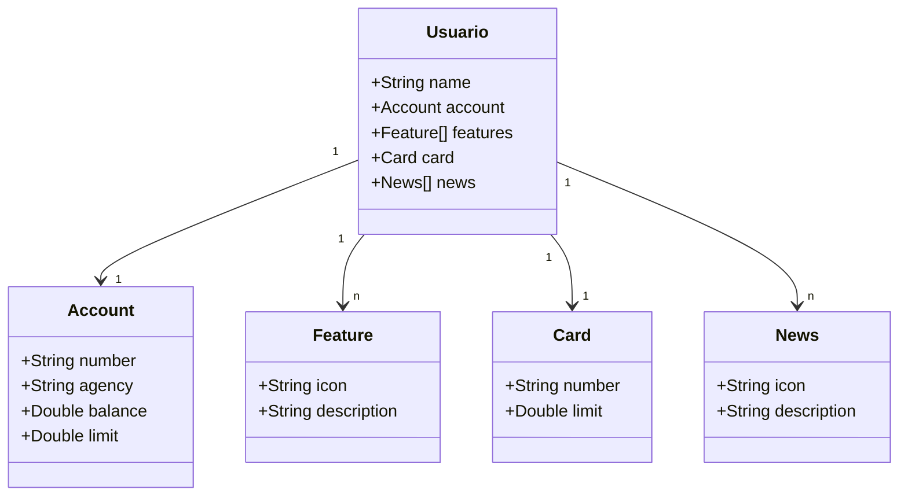
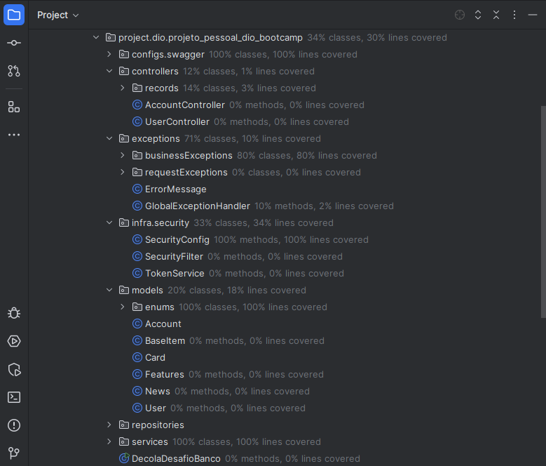
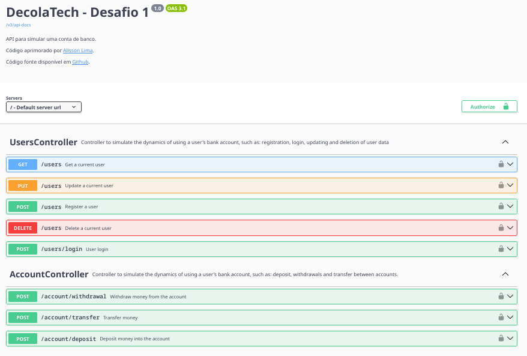
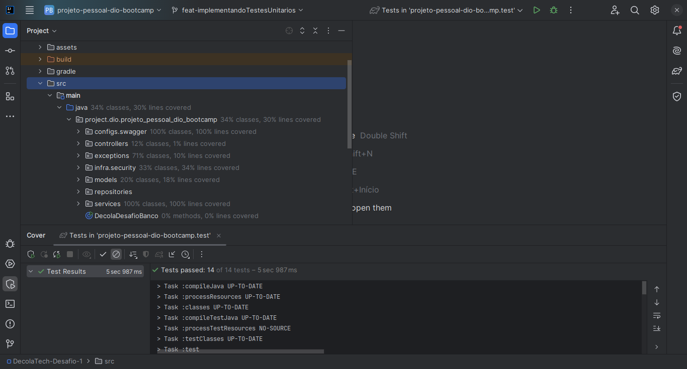
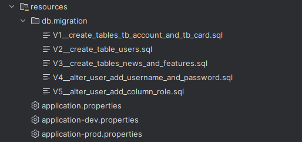
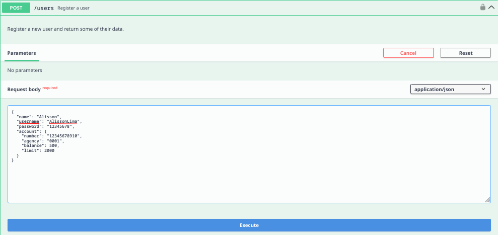
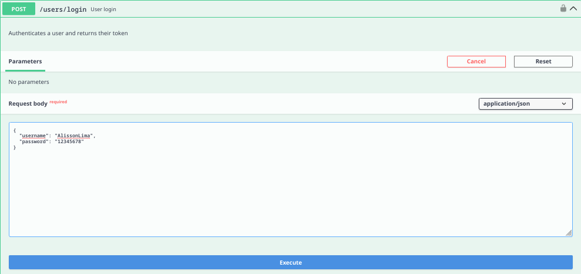
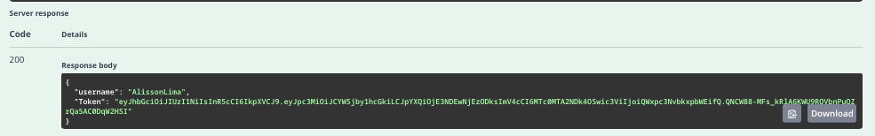
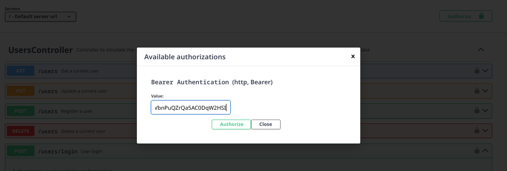
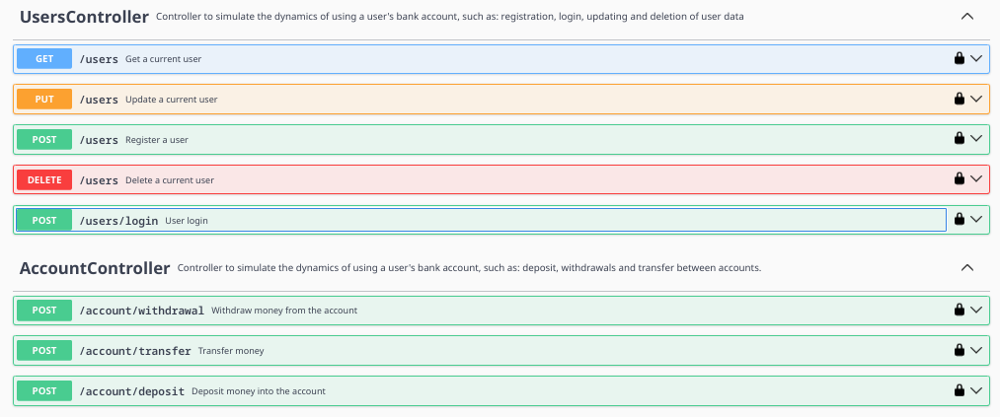

# 📌 Projeto - Sistema Bancário API

## 📖 Sobre o Projeto
Este projeto é uma API REST para um sistema bancário promovida pelo Decola Tech 2025, desenvolvida com **Java 17** e **Spring Boot 3**. Ele oferece funcionalidades como autenticação de usuários, operações bancárias e tratamento de erros, seguindo boas práticas de desenvolvimento.

## Modelo de domínio

## 🚀 Tecnologias Utilizadas

### 🔹 Java 17
Linguagem principal do projeto, trazendo melhorias de desempenho, segurança e novos recursos modernos.

### 🔹 Spring Boot 3
Framework que facilita o desenvolvimento de aplicações Java, fornecendo um ambiente configurado para criação de APIs REST.

### 🔹 Flyway
Ferramenta para controle de versões do banco de dados, garantindo migrações seguras e organizadas.

### 🔹 Spring Security
Responsável pela autenticação e autorização dos usuários na API, garantindo um acesso seguro aos endpoints.

### 🔹 Gradle
Ferramenta de automação de build usada para gerenciar dependências e compilar o projeto.

##  Padrão de Desenvolvimento no Git

O projeto seguiu um fluxo baseado no **Git Flow**.

### 🔀 Estrutura de Branches  
No fluxo de desenvolvimento eu utilizei a seguinte estrutura de branches:

- **`main`**: Contém a versão estável e pronta para produção do projeto.  
- **`develop`**: Branch principal para o desenvolvimento contínuo, onde novas funcionalidades são integradas antes de serem mescladas na `main`.  
- **Feature Branches (`feat-nome-da-funcionalidade`)**:  
  - Para cada nova funcionalidade ou melhoria, foi criada uma branch a partir da `develop`.  
  - Após a conclusão, a branch era revisada e mesclada de volta na `develop`.  

## 🛠 Melhorias Implementadas
O projeto recebeu várias funcionalidades novas que surgiram da minha curiosidade, basicamente um: *"Como será que faz isso?"*.

### 🔐 Autenticação e Autorização
- Implementação de autenticação baseada em **JWT (JSON Web Token)**.
- Proteção de endpoints utilizando **Spring Security**.
- Definição de permissões para usuários autenticados.

### 📌 Novos Endpoints
#### 🧑 Usuário
- **Login**
- **Deleção de conta** 🔐
- **Atualização de dados** 🔐
- **Obtenção de informações do usuário** 🔐
#### *Ps: os endpoints com *"🔐"* necessitam de autenticação(login)*

#### 💳 Conta Bancária
- **Saque** 🔐
- **Depósito** 🔐
- **Transferência** 🔐
#### *Ps: os endpoints com *"🔐"* necessitam de autenticação(login)*

### ⚠️ Tratamento de Erros
- Implementação do **ExceptionHandler** para capturar e retornar respostas padronizadas por meio de uma classe para erros na API.

### ✅ Validação de Entrada
- Uso de **Records** e da biblioteca **Validation** para garantir que os dados enviados nas requisições sejam válidos antes de serem processados.

## 🧪 Testes Unitários
Os **testes unitários** foram uma grande prioridade no projeto, soube recentemente da importância dos testes e me esforcei ao máximo para aprender e realizá-los, infelizmente, devivo ao tempo, só consegui fazer os testes na camada de serviço, no entanto, consegui cobrir **100% dos serviços da aplicação**!

- **Junit e Mockito** foram utilizados para garantir que cada funcionalidade atuando da maneira que eu esperava.
- Testes cobrem cenários de sucesso e falha, validando regras de negócio e segurança.

## 📸 Capturas de Tela

## 🔗 Documentação Pública (Swagger)
A API possui uma documentação interativa no Swagger, acessível pelo seguinte link:

➡️ **[Acessar Documentação da API](#)** __

## 🔗 Como usar?

**1 - Registre-se, só é necessário preencher os dados so usuário e da conta,**
**todas as das funcionalidade só envolvem essas duas entidades.**

**2 - Faça login**

**3 - Pegue o token que foi retornado após
o login(você vai usar ele para acessar outras rotas).**

**4 - Clique em "Authorization" no canto superior direito e insira o token**

**4 - Agora todas as rotas podem ser usadas :)**

**_Obs: Para utilizar a rota de transferência você deve ter cadastrado pelo menos dois usuários.
Se você for tentar fazer login ou registrar um novo usuário, lembre-se de deslogar antes._**

---
✨ **Desenvolvido com paixão por Alisson Lima :)** ✨

